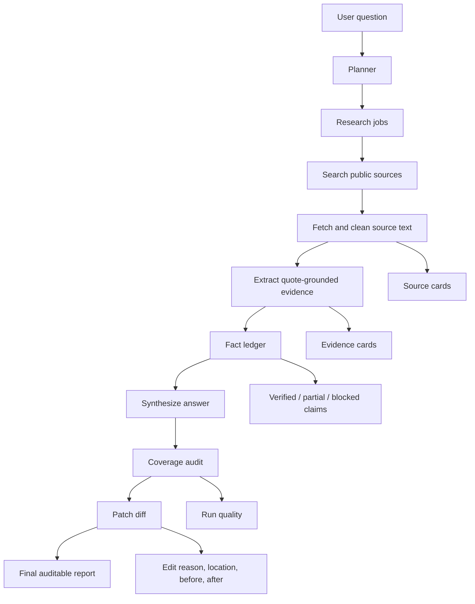

# SYNAPSE Architecture Overview

SYNAPSE is designed as an evidence-first research pipeline. Each stage has one
responsibility and passes structured data to the next stage.

## Stage Contracts

| Stage | Input | Output | Trust Rule |
| --- | --- | --- | --- |
| Planner | User question | Research jobs and coverage checklist | The answer must cover these targets. |
| Searcher | Research job | Search headers | Headers are candidates, not verified facts. |
| Source fetcher | Search headers | Fetched source text | Only fetched text can ground evidence. |
| Evidence extractor | Source text | Evidence items with quotes | Evidence must include source URL and quote. |
| Fact checker | Evidence | Fact ledger | Claims are verified, partial, unsupported, or contradicted. |
| Synthesizer | Fact ledger | Draft answer | Final claims must cite fact IDs. |
| Coverage auditor | Draft + evidence + ledger | Coverage patch | Missing coverage and weak claims are flagged. |
| Patch applicator | Draft + patch | Final report | Edits include reason, location, before, after. |
| Validator | Final artifact | Pass/fail result | Fake URLs, missing quotes, and unsupported claims fail. |

## Why This Matters

Traditional chatbot output compresses research into prose. SYNAPSE preserves the
research trail so a human can inspect how the answer was created and whether it
deserves trust.

