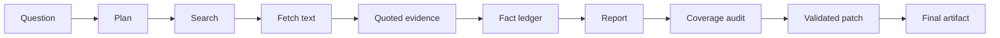

# Architecture overview

Search results are leads. Fetched source text grounds evidence. Evidence enters
the fact ledger, and only ledger facts may enter the report. The coverage pass
can edit the draft only through referenced patch operations.

Detailed contracts and provider boundaries are documented in
[ARCHITECTURE.md](../ARCHITECTURE.md).
